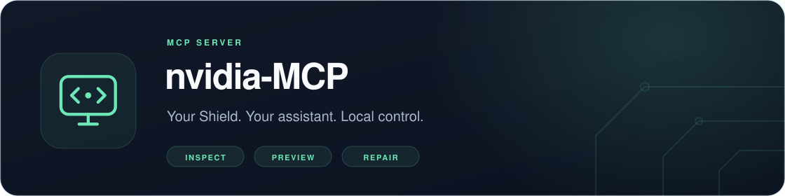
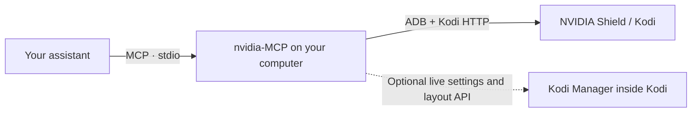
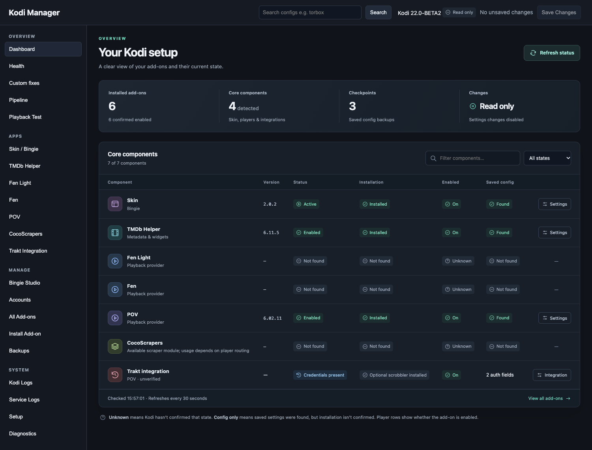

<p align="center">
  
</p>

<p align="center">
  <a href="https://github.com/glasgowm148/nvidia-MCP/actions/workflows/ci.yml"></a>
  <a href="https://github.com/glasgowm148/nvidia-MCP/releases"></a>
  <a href="pyproject.toml"></a>
  <a href="LICENSE"></a>
</p>

<p align="center">
  <a href="#quick-start">Quick start</a> ·
  <a href="#what-you-can-do">Features</a> ·
  <a href="#optional-kodi-manager-companion">Kodi Manager</a> ·
  <a href="#documentation">Documentation</a>
</p>

**Local MCP tools for NVIDIA Shield TV and Kodi.** Give your assistant the tools to inspect your setup, diagnose playback problems, adjust settings and apply reversible repairs from your computer. Works over your home network on macOS, Windows and Linux, with an MCP client that supports stdio. No cloud account is required for the server.

> [!NOTE]
> **Alpha / prerelease.** Start with read-only access. See [tested compatibility](docs/compatibility.md)
> and [verification evidence](docs/verification.md) before using repair or upgrade tools.

## What you can do

| Task | What the assistant can inspect or do | Connection |
| --- | --- | --- |
| Diagnose the Shield | Connection readiness, installed apps, bounded logs and screenshots | ADB |
| Understand Kodi | Version, skin, active profile, playback state and installed add-ons | Kodi HTTP |
| Investigate playback | Read redacted logs and relevant profile settings | ADB or mounted storage |
| Explore widget sources | Preview one page of an installed add-on's folders | Kodi HTTP; browsing opt-in |
| Repair settings and files | Preview exact changes, check versions/checksums, back up and restore | File access; write mode |
| Upgrade an Android app | Inspect local APKs or split sets, preview installation, save recovery files | ADB + SDK Build Tools; write mode |
| Configure Bingie | Inspect hubs, preview layout changes and apply a reviewed plan | Optional Kodi Manager |

The bundled repair playbook covers profiles, audio, autoplay, source priorities, skin widgets and stale stream URLs. It helps distinguish **installed**, **enabled**, **configured** and **actually used**. It is available as the `nvidia://playbook` resource and `audit_kodi` prompt.

## Quick start

**You prepare the TV. Your agent handles the computer.** Use an agent with terminal/file access; the computer and Shield must be on the same home network.

### 1. Prepare the Shield and Kodi

| On the TV | Where to go | What to do |
| --- | --- | --- |
| Find the Shield IP | **Home → Settings gear → Device Preferences → About → Status → IP address** | Note the local IPv4 address, such as `192.168.1.50`. Use yours. |
| Unlock developer options | **Settings → Device Preferences → About → Build** | Press the remote's centre/select button **seven times**. |
| Enable network debugging | Back to **Device Preferences → Developer options → Debugging** | Turn **Network debugging** on. |
| Enable Kodi control | Inside Kodi: **Settings → Services → Control** | Enable **Allow remote control via HTTP** and **Require authentication**. Set a username/password and note the port, usually `8080`. |

Older firmware may put **About** directly under Settings. If Kodi hides the control options, select the **Standard** or **Expert** settings level. Leave the Shield awake and Kodi open. The [TV preparation guide](docs/setup.md) has full directions and troubleshooting.

### 2. Give this prompt to your agent

Replace the IP and port. Provide Kodi credentials privately when requested.

```text
Set up https://github.com/glasgowm148/nvidia-MCP on this computer.
Read docs/agent-setup.md and complete the computer setup automatically.
Shield network debugging and Kodi HTTP control are enabled.
Shield IP: YOUR_SHIELD_IP
Kodi HTTP port: 8080
Ask privately for the Kodi username/password if needed.
Install missing dependencies, connect ADB, preserve my existing MCP servers,
register nvidia-MCP and verify its read-only tools.
Tell me when to approve the debugging prompt on the TV.
Keep write mode and plugin browsing off; do not interrupt playback.
```
 The [agent setup guide](docs/agent-setup.md) covers dependency installation, private configuration and connection checks. You do not need to run commands or edit JSON yourself.

### 3. Approve the connection on the TV

When the agent connects, select **Allow** on the Shield's debugging prompt. Optionally select **Always allow from this computer** for your trusted computer. Tell the agent you have approved it.

Then try: **“Read the Shield repair playbook and audit Kodi without interrupting anything.”**

## How it connects


 The server targets **one configured Shield**. Core diagnostics and file repairs work without the companion. Credentials and recovery backups stay in your local configuration/storage.

## Optional Kodi Manager companion

[Kodi Manager](https://github.com/glasgowm148/kodi-manager) adds live add-on settings, playback pipeline inspection, a browser dashboard and supported Bingie layout editing. It also offers a standalone Python client/parser library.



*Optional companion dashboard, captured from the public UI with synthetic demo data. The MCP server itself is a stdio service.*

The MCP distribution includes a pinned **Kodi Manager 0.6.2** ZIP (the public [v0.6.2 release](https://github.com/glasgowm148/kodi-manager/releases/tag/v0.6.2), checksum-verified). Your agent can export it with `nvidia-mcp --export-manager ./companion`, verify it and transfer it to the Shield. Install through Kodi's native **Install from zip file**, then let the agent configure the connection. Follow the [companion setup guide](docs/companion.md).

Kodi Manager 0.4+ is supported; the widget-cache tools need 0.6+. Older installations should be upgraded; back up customized installations before replacing them. Layout writes require reviewed **Bingie 2.0.2 / Skin Shortcuts 2.0.3 source hashes**; unknown variants remain view-only. Installing the Python library alone does not install the TV service.

## Making changes

**Read-only is the default.** Writes and plugin browsing have separate opt-ins. File/configuration changes use backups; disruptive tools check playback, and lifecycle tools also check the foreground Android app. An unknown playback state blocks disruptive changes. Remote-button input still needs permission from anyone using the TV.

Ask the agent to inspect and preview a change before enabling it. Live companion writes also need Manager's own write mode. See [configuration and operation rules](docs/configuration.md), [repair workflows](docs/repairs.md) and [APK upgrades](docs/apk-upgrades.md).

Cloud account signup/OAuth, Trakt history migrations and household provider/skin patches are not bundled. See the [capability boundaries](docs/companion.md#capability-boundaries).

## Tool reference

*Write mode* tools exist only when `NVIDIA_MCP_ALLOW_WRITES=1`; without it the server lists 23
tools. *No TV changes* tools write only private local state or run opt-in, idle-only reads.

<!-- tools:start (generated by scripts/gen_tool_docs.py; do not edit) -->
| Tool | Title | Access | What it does |
| --- | --- | --- | --- |
| `kodi_addon_settings` | Add-on settings | read-only | Search/page redacted settings in the active profile; Manager includes schema/defaults, otherwise saved XML only. |
| `kodi_addons` | Kodi add-ons | read-only | List installed add-on IDs, versions and enabled states; enabled is not proof of use/authentication. |
| `kodi_backup_file` | Back up Kodi file | read-only | Save a private local rollback snapshot of one Kodi file. Does not modify the Shield. |
| `kodi_backups` | Kodi file backups | read-only | List the latest 50 private per-file snapshots without exposing their contents. |
| `kodi_browse` | Browse Kodi folder | no TV changes | Preview one page of actual provider/library folders; opt-in, idle-only. Routes with play/auth/settings/maintenance verbs are refused. |
| `kodi_layout_apply` | Apply hub layout | write mode | Optional Manager: apply the exact staged plan within 10 minutes; Manager backs up and rejects stale revisions. |
| `kodi_layout_preview` | Preview hub layout | no TV changes | Optional Manager: stage existing section rows with section_id and expected_revision; no layout write. |
| `kodi_layout_rebuild` | Rebuild skin menus | write mode | Optional Manager: request one skin-menu rebuild while Kodi is idle and in front. Inspect TV after it finishes. |
| `kodi_lifecycle` | Start/stop Kodi | write mode | Start/stop/restart Kodi. Refuses playback; offline recovery needs permission and interrupt_other_app also needs NVIDIA_MCP_ALLOW_INTERRUPT=1. |
| `kodi_logs` | Kodi log tail | read-only | Inspect redacted Kodi log tail and crash/stream/storage signals; safe while viewing. |
| `kodi_manager_inspect` | Kodi Manager inspect | read-only | Optional Kodi Manager 0.4+: inspect saved skin hubs/rows, sources, pipeline, health or fix status. |
| `kodi_manager_widget_cache` | Kodi Manager widget cache | read-only | Optional Kodi Manager 0.6+: widget-cache status and cached rows for faster rows on any skin. |
| `kodi_manager_widget_cache_refresh` | Refresh widget cache | write mode | Optional Kodi Manager 0.6+: queue a refresh of every cached widget row while Kodi is idle. |
| `kodi_patch_apply` | Apply Kodi file patch | write mode | Apply the edits from kodi_patch_preview. Needs Kodi stopped and a matching SHA; creates an automatic backup. |
| `kodi_patch_file` | Patch Kodi file (deprecated) | write mode | Deprecated: use kodi_patch_preview and kodi_patch_apply. dry_run=true previews, false applies. |
| `kodi_patch_preview` | Preview Kodi file patch | read-only | Validate exact before/after replacements and return a redacted unified diff. Credential edits and add-on .py files are refused. No write. |
| `kodi_read` | Kodi JSON-RPC read | read-only | Run an allowlisted diagnostic JSON-RPC query (library reads default to 50 items, max 500). No arbitrary RPC, executebuiltin or playback calls. |
| `kodi_read_file` | Read Kodi file | read-only | Read a Kodi-relative text file (600 KB max) with redaction and original SHA-256. |
| `kodi_restore_file` | Restore Kodi file | write mode | Restore one snapshot while Kodi is stopped; rejects stale checksums and creates an undo snapshot. |
| `kodi_set_addon_setting` | Change add-on setting | write mode | Change a non-credential setting on a verified add-on version; backed up. Without Manager, stop Kodi first. |
| `kodi_set_setting` | Change Kodi setting | write mode | Change one non-credential, non-security Kodi setting through its runtime API, with a guisettings.xml rollback snapshot. |
| `kodi_settings` | Kodi settings | read-only | Search/page Kodi's expert settings with current/default values, avoiding a whole-schema dump. |
| `kodi_status` | Kodi status | read-only | Inspect Kodi version, skin, current profile/window and active players; no playback changes. |
| `shield_apk_apply` | Install previewed APK | write mode | Install an exact unexpired APK preview. Stopped target/idle TV, backup and readback required; reports progress. Never uninstalls/downgrades/retries. |
| `shield_apk_backups` | APK recovery bundles | read-only | List private APK recovery bundles for this Shield, with phases and Kodi data snapshot checksums. |
| `shield_apk_preview` | Preview APK upgrade | no TV changes | Stage 1–20 local APKs, verify SDK/ABI/signers and save the installed originals (downloads up to 1 GB locally). New apps need signers configured in NVIDIA_MCP_TRUSTED_SIGNERS; trusted_signers can only narrow that set. No TV changes. |
| `shield_apk_status` | APK recovery bundle status | read-only | Report one recovery bundle's phase, saved files and the version now installed on the Shield. |
| `shield_apps` | Installed Android apps | read-only | List installed Android package names (no app/account data). |
| `shield_connect` | Connect ADB | no TV changes | Connect ADB to the configured Shield only. Accept its debugging prompt on the TV. |
| `shield_connection` | Shield connection check | read-only | Probe ADB, Kodi HTTP and optional Manager separately; explain authorization/readiness failures. |
| `shield_logcat` | Android log tail | read-only | Read a bounded Android log tail for native crashes. Redaction is best effort. |
| `shield_remote` | Remote button | write mode | Send one remote button when Kodi is idle and only Kodi or the home screen is in front. allow_during_playback also needs the user's NVIDIA_MCP_ALLOW_INTERRUPT=1. |
| `shield_screenshot` | TV screenshot | read-only | Capture the current TV screen without navigation. Screens can contain private information. |
| `shield_status` | Shield status | read-only | Inspect Shield model, Android, memory/storage, uptime, thermal/throttling and Kodi process. |
<!-- tools:end -->

## Documentation

| Guide | Use it for |
| --- | --- |
| [TV preparation](docs/setup.md) | Shield menus, IP address and first connection approval |
| [Agent setup](docs/agent-setup.md) | Computer installation, MCP registration and verification |
| [Configuration](docs/configuration.md) | Environment variables, storage and operation rules |
| [Kodi Manager](docs/companion.md) | Optional live settings, dashboard and Bingie integration |
| [Repairs](docs/repairs.md) · [APK upgrades](docs/apk-upgrades.md) | Preview, apply, verify and recover |
| [Compatibility](docs/compatibility.md) · [Verification](docs/verification.md) | Tested versions and remaining live checks |
| [Contributing](CONTRIBUTING.md) · [Changelog](CHANGELOG.md) | Development, release checks and changes |
| [Security](SECURITY.md) | Credential handling and private vulnerability reports |

Built on the [MCP Python SDK](https://github.com/modelcontextprotocol/python-sdk/tree/v1.x), [Android ADB](https://developer.android.com/tools/adb) and [Kodi JSON-RPC](https://kodi.wiki/view/JSON-RPC_API/v13).

---

[MIT license](LICENSE). Independent project; not affiliated with NVIDIA or Kodi.
